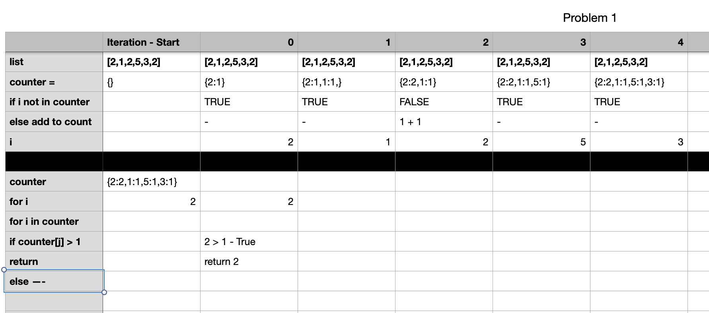
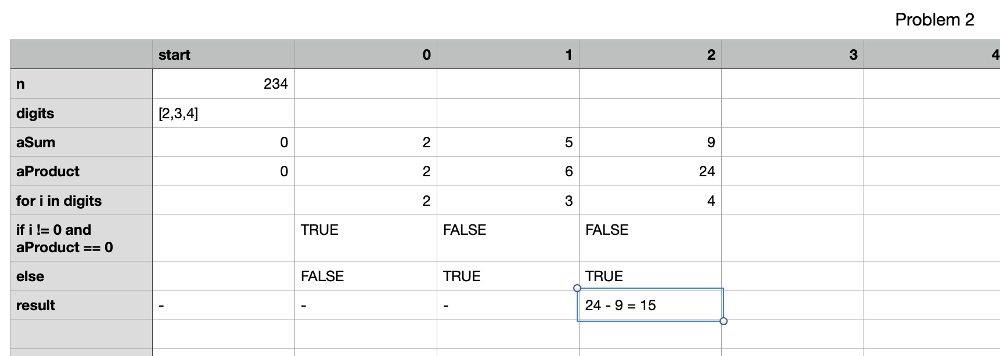

# Variable Tables Assignment

> The Assignment

1. Find 2 new problems on Leetcode and solve them following the problem solving strategy covered in a prior class to guide your thinking.
2. After you’ve written the code, use a variable table to trace through the code. Check your work using PythonTutor.
---

### Problem 1
[Problem Link](https://leetcode.com/problems/n-repeated-element-in-size-2n-array/)
[Code](variable_problem1.py)

### Problem 2
[Problem Link](https://leetcode.com/problems/subtract-the-product-and-sum-of-digits-of-an-integer/)
[Code](variable_problem2.py)

